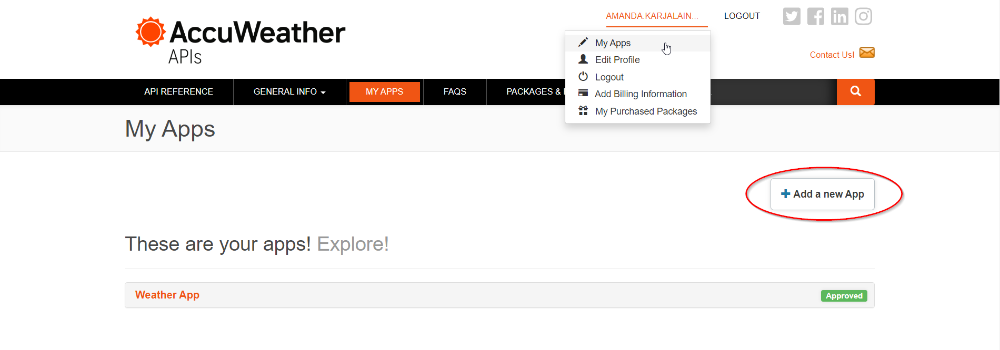
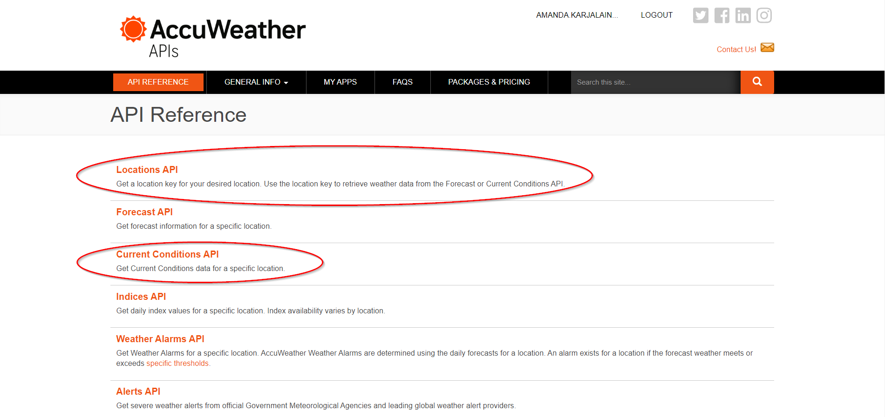
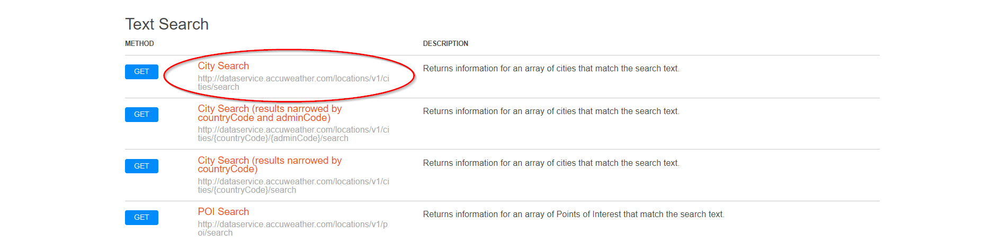
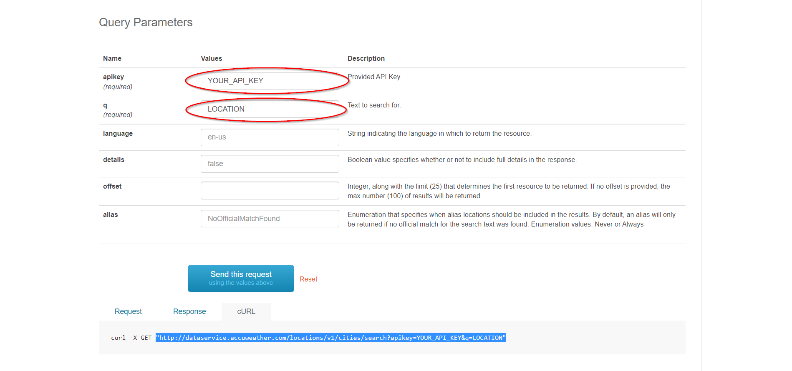
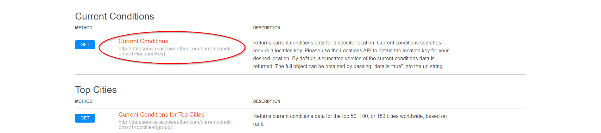
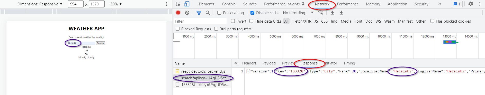
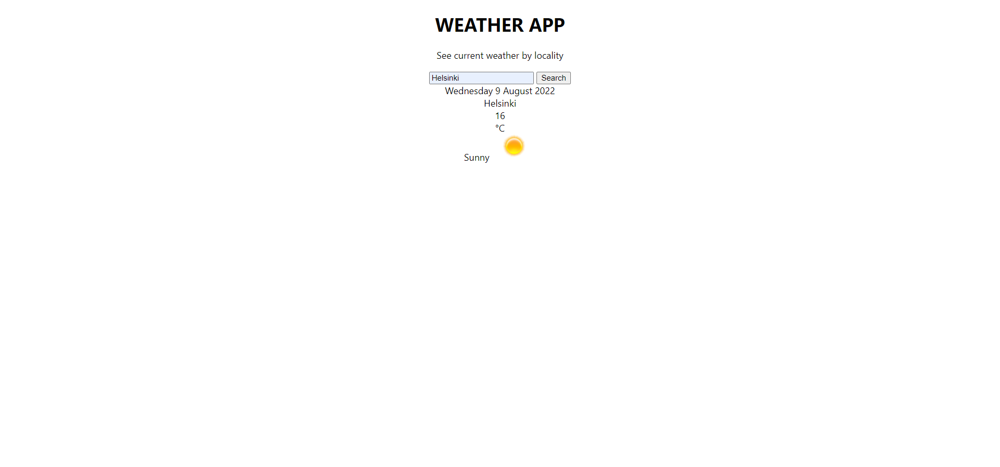
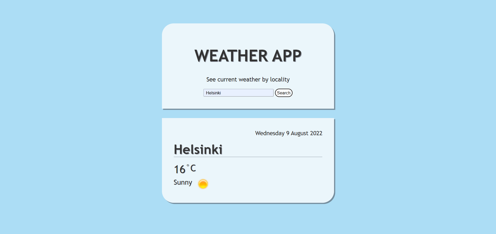

# Guide to simple Weather App using AccuWeather's API
**Creator: [Amanda Karjalainen](https://github.com/amakarj)**
## Introduction

This guide is a step-by-step guide for a simple Weather App. Weather data has been fetched from AccuWeather's Locations API and Current Conditions API. Main emphasis is on how you work with APIs - how to fetch data and display it. There will be a visual example of the app at the end, but it's not the guide's main focus, therefore, it's only a short look. 

This is the final task of a school project about React fundamentals. It's been done alone, but is worked in pairs in other tasks. Some explanations or stages, e.g. pre-installations and definitions of fundamentals, have been excluded from this task as they have already been explained elsewhere. To get introduced on earlier tasks, you can visit **[here](https://github.com/jenhakk/React.js_Fundamentals)**.

In the future, improvement of visualizing, as well as, the broader usage of different libraries and APIs are possible. Responsiveness will be improved.

## Making Preparations

### 1. Sign in to AccuWeather and create your own API key

To fetch any data from AccuWeather API, **you'll need your own API key**. You can registrate to AccuWeather **[here](https://developer.accuweather.com/)**.  
After registration and logging in, you can create a new key on **My Apps** tab by clicking a button **Add a new App**.


*Notice that you can add only one API key at time on a free account!* 

### 2.	AccuWeather’s APIs
When you’ve got the API key, the next step is to get a suitable API for your weather application.
You can see a partial listing of APIs provided by AccuWeather in the image below.  

*Weather App **requires at least two** of these APIs – one to provide a location key according to user’s input and other to retrieve current weather data based on the location key.*



#### Locations API - required location key

In the Weather App of this guide, we’ll get the location as text by user’s input. Therefore, choose a method **City Search** under **Text Search**, like in the image below.



On the site that opens, there’s a form which gives out the straight URL - for fetching data - after filling the form and clicking a button **Send this request**. 



URL’s in form of:
```
http://dataservice.accuweather.com/locations/v1/cities/search?apikey=YOUR_API_KEY&q=LOCATION
```
*Notice that you need to replace apikey and q's values with your personal key and location query (location state in the code).  
Both API key and location query are required parameters!*

#### Current Conditions API - weather data

Now that URL for the location key has been got, let’s get one for the other API – Current Conditions. The used method goes by the same name, Current Conditions, like in the image below.



URL's in form of:

```
https://dataservice.accuweather.com/currentconditions/v1/LOCATION_KEY?apikey=YOUR_API_KEY
```

*Notice that this time AccuWeather's form requires only API key. **The location key must be included into URL as well**, otherwise the second fetch won't work properly!*


## Making the Application
### 1.	Searching a city

#### States
Let’s start by importing useState Hook from React and declaring the states.
There's a need for two states: 
- **location** - stores user's input
- **weather** - stores the weather data fetched from Current Conditions API

App.js

```
import React, { useState } from 'react';
import './App.css';

function App() {
  const [location, setLocation] = useState('');
  const [weather, setWeather] = useState('');
  
...
```

#### Search bar

On this app, there’s a simple search bar (**a text typed input** and **a button**), where the user can type the name of the city. By clicking the button, value is sent to Locations API via URL we’ve got earlier.  

The input element's value is **location** state, so we need to set value to it. Create a function `inputChanged()` and connect it to the input element by `onChange` event. This enables typing to the element. The given function stores the typed value to the state by `setLocation()` whenever site renders.  

Code looks something like this now: 

```
import React, { useState } from 'react';
import './App.css';

function App() {
  const [location, setLocation] = useState('');
  const [weather, setWeather] = useState('');
  
  const inputChanged = (event) => {
    setLocation(event.target.value);
  }
  
  return(
    <div className = 'background'>
      <div className = 'content'>
        <div className = 'box searchbox'>
          <h1>WEATHER APP</h1>
          <p>See current weather by locality</p>
          
          <input type = 'text' name = 'location' placeholder = 'Search for a locality' value = {location} />{' '}
          <button>Search</button><br />
        </div>
      </div>
    </div>
  );
}
export default App;
```

*Notice that there are div elements with classes to wrap different types of contents so we can apply some CSS to them later.*

### 2. Fetching data
#### API key

Now that user can type the location, next, it should be sent forward.  
- First let’s create a new folder **components** inside **src** folder. 
-	Then add a new file **Api.js** inside the new folder and import it to **App.js**. 
-	The new component we created stores the AccuWeather’s API key, which we need for fetching data.

Api.js
 
```
const API_key = 'YOUR_API_KEY';
export default API_key;
```

App.js

```
import React, { useState } from 'react';
import './App.css';
import API_key from './components/Api.js';
function App() {

...
```

Remember, F12 is a friend. You’ll get to see the actual responses before displaying on the site.  

Below you can see a beginning of response from Locations API. The user has searched for Helsinki and API returns the data according to it. The location key **Key** we need is the second a key-value pair. It can be accessed it with **`${result[0].Key}`**.  

`[{"Version":1,"Key":"133328","Type":"City","Rank":30,"LocalizedName":"Helsinki","EnglishName":"Helsinki",`  



#### Fetching

Add an empty function `fetchWeather()` and connect it to the button by `onClick` event.
Now let’s start building the actual function. 
- Fetch **location key** using `fetch()` method by adding Locations API's URL inside it.  
  - URL: `https://dataservice.accuweather.com/locations/v1/cities/search?apikey=${API_key}&q=${location}`
- Then change response to JSON and direct the result to next `fetch()` method to get the **weather data**.  
  - URL: `https://dataservice.accuweather.com/currentconditions/v1/${result[0].Key}?apikey=${API_key}`
- Then change response to JSON, again.
- Finally set the result to **weather** state with `setWeather()` to wait for usage.

App.js

```
import React, { useState } from 'react';
import './App.css';
import API_key from './components/Api.js';

function App() {
  const [location, setLocation] = useState('');
  const [weather, setWeather] = useState('');
  
  const fetchWeather = () => {
    fetch(`https://dataservice.accuweather.com/locations/v1/cities/search?apikey=${API_key}&q=${location}`)
    .then(response => response.json())
    .then(result => {
      fetch(`https://dataservice.accuweather.com/currentconditions/v1/${result[0].Key}?apikey=${API_key}`)
      .then(response => response.json())
      .then(result => {
        setWeather(result[0]);
      })
    })   
  };
  
...

<button onClick = {fetchWeather}>Search</button><br />

...
```

### 3. Displaying the data
#### Temperature and description of weather

Now that data is fetched, we can display it on the page. This weather app will be simple and doesn’t contain other than key information of current weather. Data we’ll get and their keys are:
- **temperature** - Temperature.Metric.Value
- **description of weather** - WeatherText
- **icon for described weather** - WeatherIcon

*If you want to utilize other data, you can check them on **developer/debug tools** (F12) in **Network** and **Response** tabs.*

Data is stored in an object in API, so it consists of key-value pairs. The object is fetched and set to the **weather** state, so we’ll get values we want by typing `{weather.keyname}`. You can form your weather data as you want on the site - this is how it is arranged in this Weather App: 

```
...

{(typeof weather.WeatherText != 'undefined') ? (
<div>
  <div className = 'box weatherbox'>
    <div className = 'row-city'>
      <div>{location}</div>
    </div>
    
    <div className = 'row-temp'>
      <div className = 'temp'>
        {Math.round(weather.Temperature.Metric.Value)}
      </div>
      
      <div className = 'unit'> 
        °C
      </div>
    </div>
    
    <div className = 'row-desc'>          
      {weather.WeatherText}{' '}
    </div>
  </div>
</div>
) : ('')}
        
...
```
*Notice the conditonal structure around HTML. It is there to check if data is already fetched from API and if it is, the HTML gets run. Otherwise it returns empty string and error is avoided.*  

#### Icon

Since temperature and description have been fetched, let's add the icons. AccuWeather provides an individual icon for each description **[here](https://developer.accuweather.com/weather-icons)**. Saving them to your computer by their icon number, ease their usage. After you're done, copy paste icons inside your project folder under **public**. For example, add icon next to description, like so:

```
...

<div className = 'row-desc'>          
  {weather.WeatherText}{' '}</img>
</div>

...
```

*Notice `process.env.PUBLIC_URL` before `getIcon()` function! When deploying React application to GitHub, it stops reading from **public** folder and icons won't work anymore. This way the problem is fixed and icons show alright.*  

The `` element is now in place, but you still need the function `getIcon()` to get the actual icon. It happens with a icon number we got from API response. 
Add the function behind some other function before `return()`. The function gets **WeatherIcon** as the parameter, which is numeral, and returns the respective image from icons saved to the computer.

```
...

const getIcon = (i) => {
  return `/icons/${i}.png`;
}

...
```
#### Date

Everything we wanted, is now fetched. So, let's add some additional elements to the application, like date.  
The `dateBuilder()` function takes `Date` object as a parameter, which is utilized to get current weekday, day number, month and year.

```
...

<div className = 'row-date'>
  {dateBuilder(new Date())}
</div>

...
``` 

```
...

const dateBuilder = (d) => {
  let months = ["January", "February", "March", "April", "May", "June", "July", "August", "September", "October", "November", "December"]
  let days = ["Monday", "Tuesday", "Wednesday", "Thursday", "Friday", "Saturday", "Sunday"];
  let day = days[d.getDay()];
  let date = d.getDate();
  let month = months[d.getMonth()];
  let year = d.getFullYear();
  return `${day} ${date} ${month} ${year}`;
}

...
```

#### Final code

The code looks something like this, now we have added everything:

```
import React, { useState } from 'react';
import './App.css';
import API_key from './components/Api.js';

function App() {
  const [location, setLocation] = useState('');
  const [weather, setWeather] = useState('');
  
  const fetchWeather = () => {
    fetch(`https://dataservice.accuweather.com/locations/v1/cities/search?apikey=${API_key}&q=${location}`)
    .then(response => response.json())
    .then(result => {
      fetch(`https://dataservice.accuweather.com/currentconditions/v1/${result[0].Key}?apikey=${API_key}`)
      .then(response => response.json())
      .then(result => {
        setWeather(result[0]);
      })
    })   
  };
  
  const inputChanged = (event) => {
    setLocation(event.target.value);
  }
  
  const dateBuilder = (d) => {
    let months = ["January", "February", "March", "April", "May", "June", "July", "August", "September", "October", "November", "December"]
    let days = ["Monday", "Tuesday", "Wednesday", "Thursday", "Friday", "Saturday", "Sunday"];
    let day = days[d.getDay()];
    let date = d.getDate();
    let month = months[d.getMonth()];
    let year = d.getFullYear();
    return `${day} ${date} ${month} ${year}`;
  }
  
  const getIcon = (i) => {
    return `/icons/${i}.png`;
  }
  
  return (
    <div className = {(typeof weather.WeatherText != 'undefined') 
    ? ((weather.Temperature.Metric.Value <= 5)
      ? 'background cold'
      : ((weather.Temperature.Metric.Value > 20)
        ? 'background hot'
        : 'background') )
    : 'background'}>
    
      <div className = 'content'>
        <div className = 'box searchbox'>
          <h1>WEATHER APP</h1>
          <p>See current weather by locality</p>
          
          <input type = 'text' name = 'location' placeholder = 'Search for a locality' value = {location} onChange = {inputChanged} />{' '}
          <button onClick = {fetchWeather}>Search</button><br />
        </div>
        
        {(typeof weather.WeatherText != 'undefined') ? (
        <div>
          <div className = 'box weatherbox'>
            <div className = 'row-date'>
              {dateBuilder(new Date())}
            </div>
            
            <div className = 'row-city'>
              <div>{location}</div>
            </div>
            
            <div className = 'row-temp'>
              <div className = 'temp'>
                {Math.round(weather.Temperature.Metric.Value)}
              </div>
              
              <div className = 'unit'> 
                °C
              </div>
            </div>
            
            <div className = 'row-desc'>          
              {weather.WeatherText}{' '}</img>
            </div>
          </div>
        </div>
        ) : ('')} 
      </div>
    </div>
  );
}

export default App;
```

### 4. Styling the application
#### Weather App without any styling

Information's been gathered on the application but there isn't any styling except default centering React provides. It looks rather plain, so some visualising would be in order.



#### Weather App with basic visualizing

Here instead is a Weather App with applied CSS, which has been kept as quite basic but making the app look like something. Fonts have been resized, weighted, recolored and shadowed. There's a background color, which changes based on temperature. Information's been divided to own bordered flexboxes and it's styled to be clear. Like mentioned earlier, sections of code are divided by `<div>` elements with classes to make it more customisable. The div class **background** takes in class **content**, which includes everything you can see on the site.



#### Background

For background color to change based on temperature, there's a short piece of conditional structure checking the temperature in the beginning of `return()`.  

First of all it checks if WeatherText has been fetched from API. If that is not found, default blue background will be shown. In case of fetching has happened successfully, it checks next if temperature is 5 Celcius degrees or colder. If yes, purplish blue will be shown, otherwise it continues checking if temperature is warmer than 20 Celcius degrees. If the answer is yes, pink background color will be shown. Otherwise it's the default blue.

*Notice that this piece of code replaces `<div className = 'background'>` completely, so, `</div>` is already in place.*

```
return(
  <div className = {(typeof weather.WeatherText != 'undefined') 
        ? ((weather.Temperature.Metric.Value <= 5)
          ? 'background cold'
          : ((weather.Temperature.Metric.Value > 20)
            ? 'background hot'
            : 'background') )
        : 'background'}>
        
...
```

#### CSS file App.css

```
.content {
  font-family: 'Trebuchet MS', 'Lucida Sans Unicode', 'Lucida Grande', 'Lucida Sans', Arial, sans-serif;
  color: rgb(51, 51, 51);
  text-align: center;
  width: 100%;
  height: 1400px;
  padding-bottom: calc(46% - 1000px);
}
.background {
  background-color: rgb(172, 221, 245);
  padding-top: 5em;
}
.background.cold {
  background-color: rgb(167, 179, 237);
}
.background.hot {
  background-color: rgb(246, 178, 219);
}
.box {
  background-color: rgba(253, 253, 253, 0.788);
  width: 30%;
  height: fit-content;
  padding: 2.5em 2.5em;
  box-shadow: 0.25em 0.25em rgba(63, 63, 72, 0.5);
}
.box.searchbox {
  margin: auto;
  border-top-right-radius: 2.5em;
  border-top-left-radius: 2.5em;
}
.box.weatherbox {
  margin: 2em auto;
  border-bottom-right-radius: 2.5em;
  border-bottom-left-radius: 2.5em;
}
.box h1 {
  font-size: 3.5em;
  text-shadow: 2px 2px rgb(50, 50, 70, 0.5);
}
.box p {
  font-size: 1.25em;
  text-shadow: 0.5px 0.5px rgb(50, 50, 70, 0.5);
}
.box input, button {
  background-color: white;
  font-size: 0.9em;
  text-shadow: 0.4px 0.4px rgb(50, 50, 70, 0.5);
  border: 0.05em solid rgba(131, 140, 151, 0.733);
  box-shadow: 0.05em 0.05em rgb(194, 194, 194);
}
.box input {
  width: 45%;
  height: 1.2em;
  padding: 0.3em 0.1em 0.2em 0.5em;
  border-radius: 0.15em;
}
.box button {
  width: min(fit-content, 60%);
  height: 2em;
  border-radius: 1em;
}
.row-date {
  display: flex;
  flex-direction: row-reverse;
  font-size: 1.25em;
  font-weight: 500;
  text-shadow: 0.4px 0.4px rgb(50, 50, 70, 0.5);
}
.row-city {
  display: flex;
  flex-direction: row;
  font-size: 2.8em;
  font-weight: 600;
  text-shadow: 1.8px 1.8px rgb(50, 50, 70, 0.5);
  margin: 0.4em auto;
  border-bottom: 0.5px solid rgb(50, 50, 70, 0.5);
}
.row-temp {
  display: flex;
  flex-direction: row;
  font-weight: 500;
  text-shadow: 1.3px 1.3px rgb(50, 50, 70, 0.5);
  padding-bottom: 0.5em;
}
.temp{
  font-size: 2.4em;
}
.unit {
  font-size: 1.5em;
}
.row-desc {
  display: flex;
  flex-direction: row;
  font-size: 1.5em;
  font-weight: 500;
  text-shadow: 1px 1px rgb(50, 50, 70, 0.5);
}
```

## Weather App

https://user-images.githubusercontent.com/75020361/183698490-36f03d76-f419-4025-9162-a137a42af953.mp4

